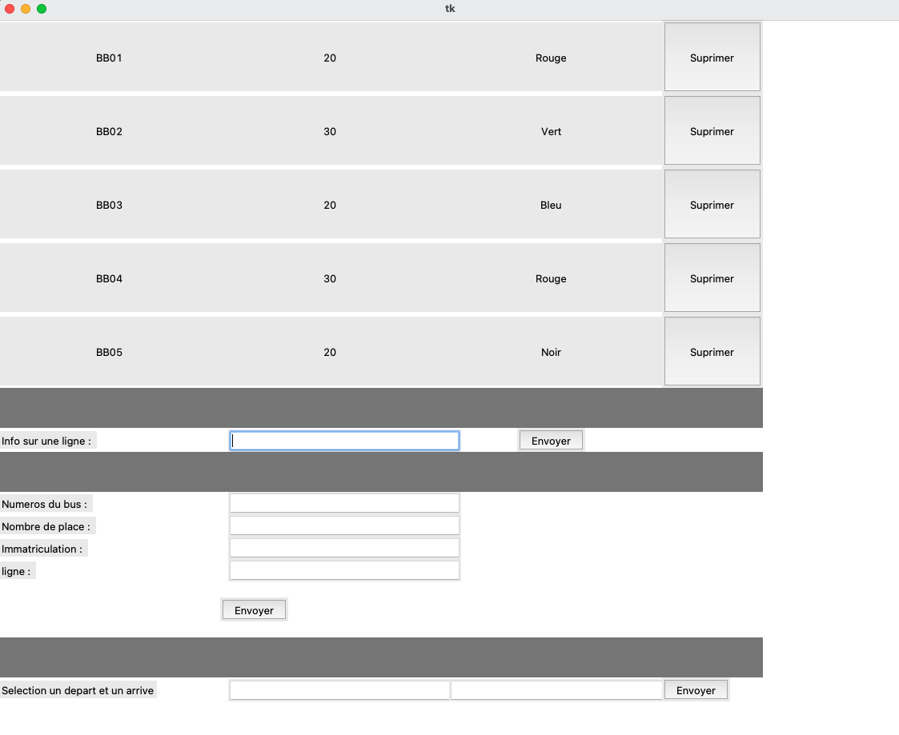
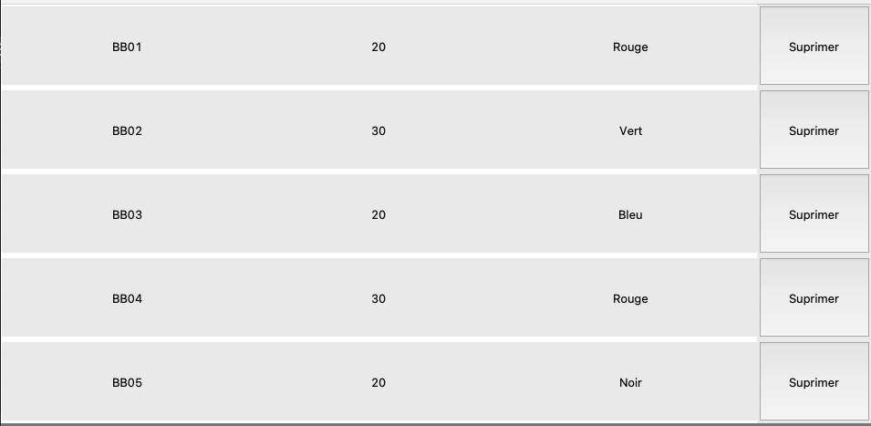
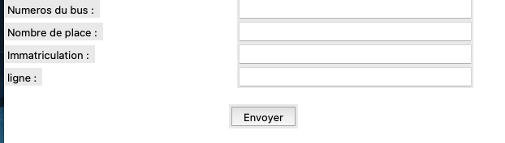
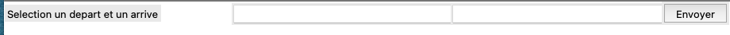

# Breizhibus

### Ma fenetre entier 

---

Mon graphique va appeler une fonction dans mon fichier <strong>Query</strong> qui va récupérer toutes les lignes ainsi que des informations, pour ensuite les afficher

---

Je prends un nom de ligne et cela va chercher dans la base de données les bus ainsi que les arrêts de cette ligne 

---

Je prends Numeros du bus, Nombre de place, Immatriculation, ligne et les envoie à la base de données à travers une fonction. La fonction va verifier si le bus existe  ou si la ligne existe si c'est le cas elle va renvoyer une pop up avec l'erreur

---

Je prends 2 arrets et je verifie s'il y a une ligne en commun en les affichant en pop up

---
## Choix techniques

J'ai utilisé la librairie mysql.connector pour faire mes requetes.

Du language python pour faire mes algos 

La librairie tkinter pour faire le graphique 

---
## Difficultés rencontrées

 j'ai eu pas mal de difficultés avec tkinter je suis pas trés fan du graphique je prefere trés largement faire des algos

Est-ce une erreur de ma part? Mais vers la fin du projet j'ai trouvé qu'il me manquait du temps et j'aurai aimer améliorer mes requetes et faire une BFS pour les trajets avec le rendu des katas/briefs j'ai du abandonner le projet je trouve cela domage.

J'ai tardé avant de faire le projet et je me suis laissé submerger avec les autres projets il me faut plus d'organisation
